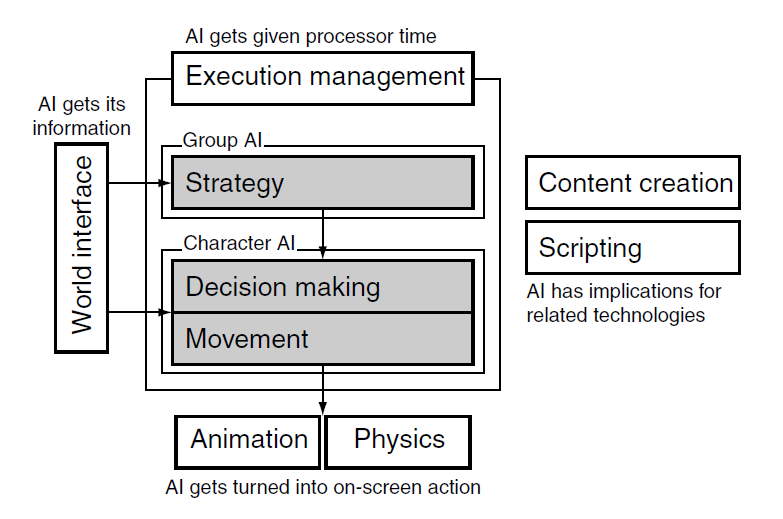

- Notes from  Artificial Intelligence for Game by Ian Millington and John Funge. www.ai4g.com contains a library of source code.

### 1. AI Model



AI tasks have three sections: movement, decision making and strategy. Board game only requires strategy level,  and some real-time games do not have strategy.

1.1 Movement

Movement is turning decision into action. (Decision 为射击， 则Movement为将枪指向角色并发射子弹)

1.2 Decision Making

每个玩家可以处于很多种状态(攻击，站立，躲藏，探索，换子弹，...). 决定哪种行动是目前最适合的行动

1.3 Strategy

对于大部分3D游戏，Movement AI 和 Decision making AI 已经够用了，但如果涉及到团队合作，则需要 Strategy AI. 

1.4 Infrastructure

AI 需要来自游戏的information (perception)， 并将Movement转化为 Animation/ Physical Simulation.  Working out what information the character knows 往往是AI programmer 最大的设计与debugging所在。

1.5 Agent-based AI

Agent-based AI, 从游戏中提取data, 然后决定which action to take, bottom up. 

Non-agent based AI, 决定how everything out to act from top down. (e.g. GTA 3, 交通与行人的移动完全取决于日期，区域等)

### 2. Algorithms, Data Structures and Representation

2.1 Algorithms

Steps to solve an AI problem by algorithms

```
 A general description of how the solution works, including diagrams where they are needed
 A pseudo-code presentation of the algorithm
 An indication of the data structures required to support the algorithm, including pseudocode,
where required
 Particular implementation nodes
 Analysis of the algorithm’s performance: its execution speed, memory footprint, and scalability
 Weaknesses in the approach
```

2.2 Representation

将data转化成suitable format for AI. 这样往往会失去一些信息，但是会增加处理效率

### 3. The complexity fallacy

很多时候，简单的算法可能比复杂的算法更好。最重要的是matching。 

3.1 When simple things look good

Pac-Man（吃豆人）. 玩家有normal和power-up state. Normal态， 鬼有一定概率选择靠近玩家的方向，也有一定概率随机选择。

3.2 When complex things look bad

Knowing when to be complex and when to stay simple is the most difficult element of the game AI programmer's art. The best AI programmers are those who can use a very simple technique to give the illusion of complexity. 

3.3 Perception Window

在大多数时候，一个玩家只会在一小段时间内发现敌人。你需要确保，游戏的AI即符合游戏的设定，又符合玩家观察到的角度。

3.4 Change of behavior

当一个角色change behavior的时候，change 本身会比changed behavior更显著。当玩家在NPC附近时，change behavior应该到real-time strategy. 一个简单的方式就是设置2套动作- a normal action and a player-spotted action。

### 4. The kind of AI in Games

Hacking, heuristics (works in most, but not all cases), and algorithms

4.1 Hacks - "If it looks like a fish and smells like a fish, it's probably a fish"

并不需要复杂的cognitive models, learning, or genetic algorithms. 只需要一点code, 在正确的地点执行正确的animation.

4.2 Heuristics (path-finding, or goal-oriented behaviors)

Trade-off between speed and accuracy. 

In many strategic games, including board games, different units or pieces are given a single numeric value to represent how“good”they are. This is a heuristic; it replaces complex calculations about the capabilities of a unit with a single number. And the number can be defined by the programmer in advance. The AI can work out which side is ahead simply by adding the numbers.

There isn’t an algorithm or a technique for this.And you won’t find it in published AI research. But it is the bread and butter of an AI programmer’s job.

Common heuristics

- Most Constrained- 比如一个障碍，只有有最先进的武器才能攻破。在选择攻击者时，应选择那个角色
- Most difficult first- 比如匹配2方战力，先分配最强的
- Most promising first- 当有多个选择时，自定义一个函数，选择分数高的

4.3 Algorithms 

Hacks and heuristics意味着你需要经常去调轮子。算法用来解决普适性问题。

This book is about this kind of technique, and the next part introduces a large number of them. Just remember that for every situation where a complex algorithm is the best way to go, there are likely to be at least five where a simpler hack or heuristic will get the job done.

### 5. Speed and memory

A comprehensive pathfinding system can take tens of milliseconds to run per character. Clearly, in an RTS with 1000 characters, there is no chance of running each frame for many years to come.

- SIMD (single instruction, multiple data) processing

  当多个游戏角色需要同时计算欧拉距离，以得到行动路线时(通常是4个)，更新算法

  In this book we’ve not provided SIMD implementations for algorithms. The use of SIMD is very much dependent on having several characters doing the same thing at the same time. Data for each set of characters must be stored together (rather than having all the data for each character together, as is normal), so the SIMD units can find them as a whole. This leads to dramatic code restructuring and a significant decrease in the readability of many algorithms. Since this book is about techniques, rather than low-level coding, we’ll leave parallelization as an implementation exercise, if your game needs it.

- Multi-core processing and hyper-threading

  There is a set of algorithms on the processor that works out how and where to split the code and predicts the likely outcome of certain dependent operations; this is called **branch prediction**. This design of processor is called **super-scalar**.

  ​


